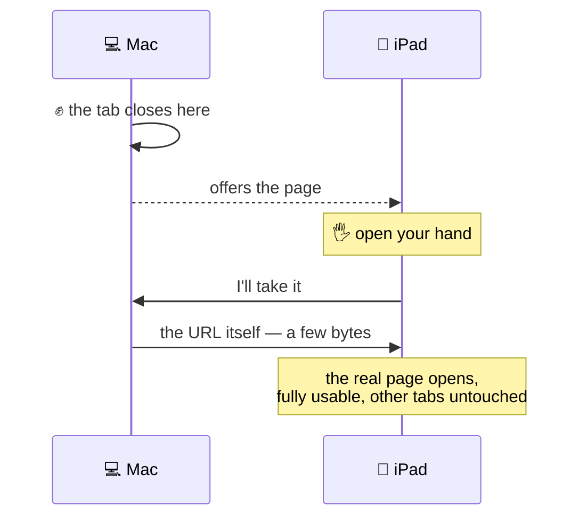

<div align="center">

# 🦆 QuackCast

### Move what you're working on to another device — with a wave of your hand.


</div>

---

## The gestures

| | Gesture | What happens |
|:--:|---|---|
| ✊ | **Close your hand** | Grabs the page — or window — you're looking at |
| 🖐️ | **Open your hand** *at another device* | It lands **there** |
| ✌️ | **Peace sign** | Screenshot, saved to your Desktop |

No clicking, no menus, no picking a device from a list. **The device you walk
up to is the one that receives it** — because it's the one that can see your hand.

---

## A link doesn't get streamed. It *moves*.

This is the part that makes QuackCast different from screen sharing:



Grab a web page and **the tab closes on your Mac**. Open your hand at your
iPad and the *actual page* opens in its browser — instantly, at full fidelity,
scrollable and clickable, leaving its other tabs alone.

**Apps can't move like that.** A running process can't leave its machine, so a
non-browser window is sent as a **live picture** instead, while the app keeps
running on the original device. QuackCast picks the right mechanism for you.

---

## Install

### Build from source — recommended, no warnings

macOS only quarantines *downloaded* files, so an app you build yourself opens
with **no Gatekeeper warning at all**:

```bash
git clone https://github.com/auroraeye-dev/QuackCast.git
cd QuackCast
brew install xcodegen           # one-time
./scripts/package.sh --run      # build, install to /Applications, launch
```

Requires Xcode from the App Store.

<details>
<summary><b>Or download a release</b></summary>

<br>

Grab **QuackCast.dmg** from the [Releases page](https://github.com/auroraeye-dev/QuackCast/releases),
open it and drag QuackCast to Applications.

Downloaded builds are **not notarized**, so macOS warns the first time. Either
**right-click ▸ Open ▸ Open**, or clear the quarantine flag:

```bash
xattr -dr com.apple.quarantine /Applications/QuackCast.app
```

Removing that warning entirely requires notarization, which needs a paid Apple
Developer Program membership.

</details>

### First run

QuackCast asks for **Camera** (to read gestures) and **Screen Recording** (to
grab windows and take screenshots). Its setup screen links straight to the
right System Settings pane, and offers a relaunch — macOS requires one after
granting Screen Recording.

---

## Devices and trust

Every install picks a permanent, friendly name like `swift-heron-3172` and is
discovered by that, rather than an OS device name that can change or collide.

> **Trust decides *whether* a device may hand you things. Your hand decides
> *where* they go.** A device is approved once, with a button, the first time
> it offers you something. After that it's remembered and your open hand is
> enough — but taking something *always* needs the gesture at the destination.

Devices find each other over Apple's peer-to-peer Wi-Fi — the same mechanism
AirDrop uses, with Bluetooth assisting discovery. No network setup, no pairing,
no internet, and nothing leaves your local network.

---

## Platforms

| Platform | Status | Notes |
|---|---|---|
| **macOS 13+** | ✅ Sends and receives | Grabs the page you're in, or streams the focused window |
| **iPadOS / iOS 16+** | ✅ Receives · ⚠️ sends deliberately | See below |
| **Windows** | 🔭 Planned, separate build | MultipeerConnectivity is Apple-only |

<details>
<summary><b>⚠️ Why the iPad is a better receiver than a sender</b></summary>

<br>

Two iOS rules shape this, and neither can be engineered around:

- **No background operation.** iOS suspends a backgrounded app's camera and
  networking, so QuackCast must be open and in front on the iPad to take part
  at all. macOS has no such rule, which is why a Mac can sit idle and still
  participate. The app holds the iPad awake while it's in front, so auto-lock
  can't quietly end a session.
- **No reading another app's content.** There's no AppleScript on iOS, so the
  app can't read Safari's open tab. A link leaves an iPad via the clipboard
  (copy it, then make a fist) or handed in through `quackcast://send?url=…`,
  which a Shortcut or share action can use.

No iOS app can launch itself on unlock or boot. The nearest equivalent is a
Shortcuts personal automation — *when joining your home Wi-Fi → open
QuackCast* — which on iPadOS 17+ can run without a prompt.

</details>

---

## Architecture

Ports and adapters, so the decision-making stays portable and testable:

```
QuackCastCore ······ pure Swift, Foundation only, zero platform imports
├── Gesture/ ······· HandLandmarks · GestureClassifier · GestureDebouncer
├── Session/ ······· SessionCoordinator · DeviceIdentity · TrustStore
└── Ports/ ········· HandTracker · ScreenSource · PeerTransport

Adapters ·········· VisionHandTracker · ScreenCaptureKitSource (macOS)
                    MultipeerTransport · BrowserLink (macOS)
```

`QuackCastCore` holds the gesture maths and the session state machine with no
Apple frameworks attached, so it runs on any Swift toolchain — and a future
Windows port would reimplement only the three `Ports` protocols.

## Building & testing

```bash
swift run CoreCheck   # smoke test — works with Command Line Tools alone
swift test            # full XCTest suite (needs Xcode)
swift run CastPeer    # a second peer, so casting is testable on one Mac
```

`CastPeer` is worth knowing about: it joins the same service as the app, shows
the incoming window live, and reports the frame rate and bandwidth actually
achieved. It's how the connection-flapping bug was found.

Pushing a `vX.Y.Z` tag runs [`release.yml`](.github/workflows/release.yml),
which builds a universal app and attaches the DMG and zip to a GitHub Release.

<details>
<summary><b>Design notes — the non-obvious decisions</b></summary>

<br>

- **Gestures are separated by extended-finger count**, the most reliable thing
  hand tracking reports: fist (0) grabs, peace (2) screenshots, open palm (4)
  receives. Earlier designs using a finger snap and a two-handed "T" were
  dropped — any sharp noise imitated a snap, and hand tracking degrades badly
  when two hands overlap.
- **The app is not sandboxed.** Reading the frontmost browser tab needs Apple
  Events, which the sandbox blocks for directly distributed apps. macOS still
  gates Camera, Screen Recording and Automation individually. Hardened Runtime
  *additionally* requires `com.apple.security.automation.apple-events` —
  without it Apple Events fail silently, with no permission prompt at all.
- **A stable signing identity is pinned in `project.yml`.** macOS ties privacy
  permissions to an app's signature, so an ad-hoc signed app (whose signature
  changes every build) forces users to re-grant Screen Recording after every
  update.
- **Streaming is mirroring, not an extended display** — a third-party app
  cannot become a real external display. Frames are JPEG at 1100px/12fps,
  sized for a wireless link. H.264 is the main outstanding work: roughly 10×
  less bandwidth and sharper text.

</details>

---

<div align="center">
<sub>MIT licensed · built with Swift, Vision, ScreenCaptureKit and MultipeerConnectivity</sub>
</div>
