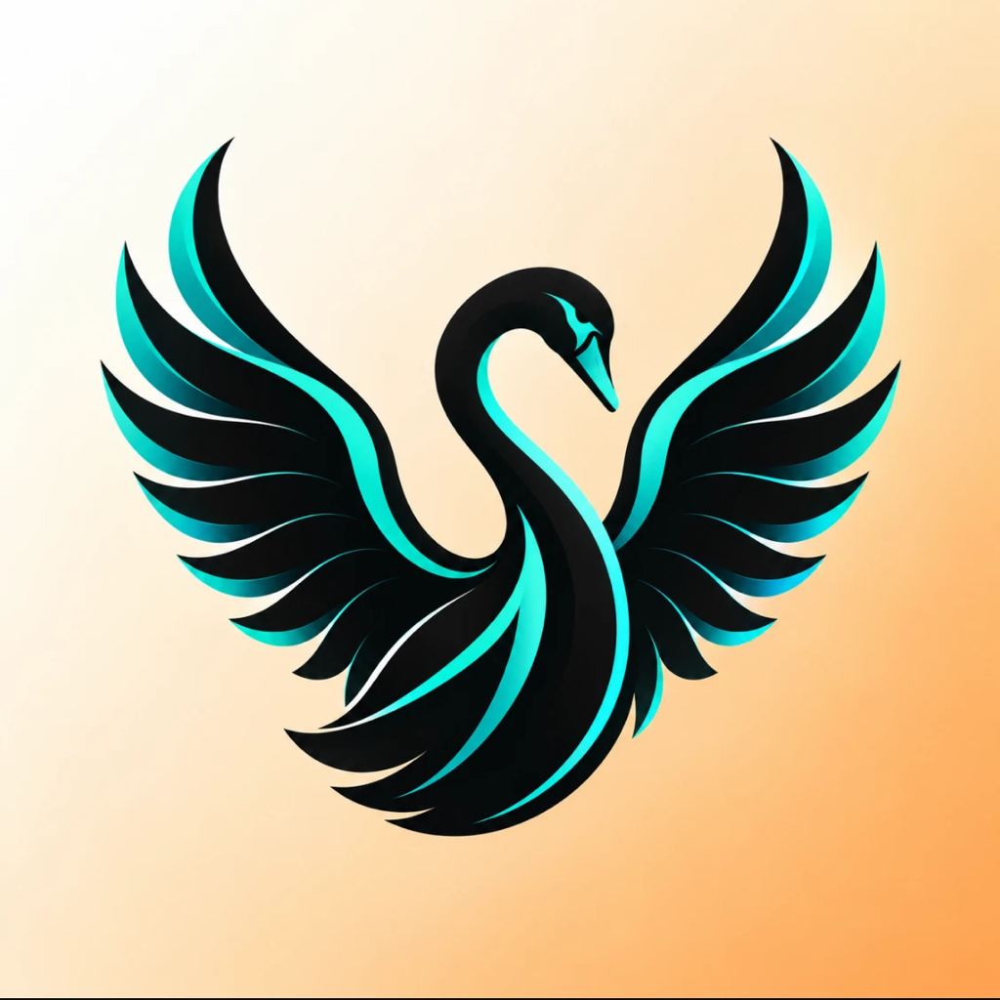

<div align="center">



# Samcast

### Move what you're working on to another device with a hand gesture.

[](https://github.com/auroraeye-dev/Samcast/releases/latest)


</div>

---

## What it does

| | Gesture | What happens |
|:--:|---|---|
| ✊ | **Close your hand** | Offers the page or window you're in |
| 🖐️ | **Open your hand** *at another device* | It lands **there** |
| ✌️ | **Peace sign** | Screenshot, saved to your Desktop |

No clicking, no menus, no picking a device from a list. **The device you walk
up to is the one that receives it** — because it's the one that can see your
hand.

### A link doesn't get streamed. It moves.

Grab a web page and **the tab closes on your Mac**. Open your hand at another
device and the *real page* opens in its browser — instantly, at full
resolution, in that machine's own browser, logged into its own accounts.

**Apps can't move like that.** A running process can't leave its machine, so a
non-browser window is **mirrored** instead: the app keeps running where it is,
and only its picture travels (H.264, full resolution, ~15 fps).

### It asks before handing over a live call

Hand tracking is never perfect, and a hand closing around a mug looks like a
fist. On an ordinary page a misread costs a reopened tab. On a **Google Meet,
Zoom, Teams or Webex call** it drops you out of the meeting.

So those get a prompt — over your browser, where you're actually looking —
and **doing nothing means no**. Moving a call to another device is a
perfectly good thing to want; it just has to be meant.

---

## Install

### macOS — download

**[Download Samcast.dmg](https://github.com/auroraeye-dev/Samcast/releases/latest)**, open it, drag Samcast to Applications.

macOS will refuse to open it on the first try, because the app is **not
notarized** — that needs a paid Apple Developer membership. Get past it with:

**Right-click the app ▸ Open ▸ Open.** Once only.

<details>
<summary>Or build it yourself — no warning at all</summary>

<br>

macOS only quarantines *downloaded* apps, so one you build opens normally:

```bash
git clone https://github.com/auroraeye-dev/Samcast.git
cd Samcast
brew install xcodegen          # one-time
./scripts/package.sh --run     # build, install to /Applications, launch
```

Needs Xcode from the App Store.

</details>

**First run** asks for **Camera** — required, it's how gestures work.
**Screen Recording** is optional: it's only needed to share a window or take
a screenshot, and links work fine without it. macOS requires one relaunch
after Screen Recording is granted; there's a button for that.

### iPhone and iPad — build it, there is no download

**Apple provides no way to install an iOS app from a website or a release
page.** An `.ipa` file here would be inert. That is a platform rule, not a
missing feature. The routes are:

<table>
<tr><th>Route</th><th>Needs</th><th>Lasts</th></tr>
<tr>
  <td><b>Xcode, free account</b></td>
  <td>A Mac with Xcode, the device plugged in</td>
  <td><b>7 days</b>, then rebuild</td>
</tr>
<tr>
  <td><b>TestFlight</b></td>
  <td>Apple Developer Program ($99/yr)</td>
  <td>90 days, installs over the air</td>
</tr>
</table>

To build it yourself:

```bash
git clone https://github.com/auroraeye-dev/Samcast.git
cd Samcast
brew install xcodegen && xcodegen generate
open Samcast.xcodeproj
```

Pick the **SamcastiOS** scheme, choose your connected device, and run. On the
device, trust the developer certificate under **Settings ▸ General ▸ VPN &
Device Management**.

One build serves both — it's universal, so the same app runs on iPhone and
iPad.

---

## What works

Verified on real hardware, not simulated:

| Path | Links | Live window |
|---|:--:|:--:|
| Mac → Mac | ✅ | ⚠️ untested |
| Mac → iPad | ✅ | ✅ |
| iPad → Mac | ✅ | — *(iOS can't capture other apps)* |
| iPhone | ✅ *(same build as iPad)* | — |

Mirroring runs at full capture resolution (1600 px) and about 15 fps. A window
nobody is touching costs almost nothing, because unchanged frames are never
sent.

<details>
<summary><b>What the iPhone and iPad can't do, and why</b></summary>

<br>

Two iOS rules shape this, and neither can be engineered around:

- **No background operation.** iOS suspends a backgrounded app's camera and
  networking, so Samcast must be open and in front on an iPhone or iPad to
  take part. A Mac can sit idle and still participate. The app holds the
  device awake while it's in front so auto-lock can't quietly end a session.
- **No reading another app's content.** There's no AppleScript on iOS, so the
  app can't read Safari's open tab. A link leaves an iPhone or iPad via the
  clipboard — copy it, then make a fist — or through `quackcast://send?url=…`,
  which a Shortcut can call.

Neither can an iOS app launch itself on unlock. The nearest thing is a
Shortcuts automation — *when joining your home Wi-Fi → open Samcast*.

</details>

---

## How devices find each other

Bonjour over your local Wi-Fi — the same mechanism AirDrop and printers use,
with no router configuration, no pairing codes, no account, and no internet
connection. **Both devices must be on the same Wi-Fi network.**

There is **no Bluetooth** anywhere in this app, despite what the gesture
suggests.

Every install invents a permanent name like `swift-heron-3172` and is
discovered by that, rather than by a device name that can change or collide.
Your real device name is never broadcast.

> **Trust decides *whether* a device may hand you things. Your hand decides
> *where* they go.** An unknown device is approved once, by you. After that
> it's remembered — but taking something always needs the gesture at the
> destination. Nothing can be pushed onto you.

If nobody catches a handoff, the page comes back on its own after 20 seconds.
And Samcast refuses to grab at all when there's no device nearby to send to.

---

## Privacy

- **The camera feed never leaves your device.** Hand tracking runs on-device
  through Apple's Vision framework. Frames are analysed in memory and
  discarded — never recorded, stored, or transmitted. What travels is the
  outcome: "a hand with four fingers extended was seen."
- **No accounts, no telemetry, no analytics, no outbound internet
  connection.** Traffic goes directly between your devices; there is no
  server in the path because there is no server.
- **Connections are encrypted.** macOS refuses to form an unencrypted peer
  session.
- **Nothing is installed or elevated.** No daemon, no login item, no admin
  rights. State is a preferences file and a log in your own profile.
  Uninstalling is dragging the app to the Trash.

<details>
<summary><b>The trade-off worth knowing about</b></summary>

<br>

Reading the frontmost browser tab needs **Apple Events**, which the App
Sandbox blocks for directly distributed apps — so Samcast runs unsandboxed.
That is a real trade, and it is why the source is here: you can read exactly
what it does with that freedom, and build it yourself in two commands.

macOS still gates Camera, Screen Recording and Automation individually, and
asks you for each.

</details>

---

## Architecture

Ports and adapters, so the decision-making stays portable and testable:

```
SamcastCore ········ pure Swift, Foundation only, zero platform imports
├── Gesture/ ······· HandLandmarks · GestureClassifier · GestureDebouncer
├── Session/ ······· SessionCoordinator · DeviceIdentity · TrustStore
│                    PageRisk (live-meeting detection)
└── Ports/ ········· HandTracker · ScreenSource · PeerTransport

SamcastPlatform ···· VisionHandTracker · ScreenCaptureKitSource
                     H264Encoder · H264DisplayLayer
                     MultipeerTransport · BrowserLink
```

`SamcastCore` holds the gesture maths, the session state machine and the
meeting detector with no Apple frameworks attached, so it runs on any Swift
toolchain.

```bash
swift run CoreCheck   # 81 checks, works with Command Line Tools alone
swift run CastPeer    # a second peer, to test casting with one Mac
```

`docs/meeting-vectors.json` pins the live-meeting rule — including the cases
that must **not** prompt, because a prompt people learn to dismiss unread
protects nobody.

---

## Windows

Experimental, and in a separate repository:
**[Samcast-Bridge](https://github.com/auroraeye-dev/Samcast-Bridge)**.

It replaces MultipeerConnectivity — a closed Apple framework Windows cannot
speak — with plain UDP and TCP. The protocol is tested in both directions;
the Windows-specific parts have never been run on Windows. It does not talk
to this app, only to a headless peer.

---

## License

MIT. See [LICENSE](LICENSE).

<div align="center">
<sub>Built by Satvik Mishra · Swift · Vision · ScreenCaptureKit · VideoToolbox · MultipeerConnectivity</sub>
</div>
